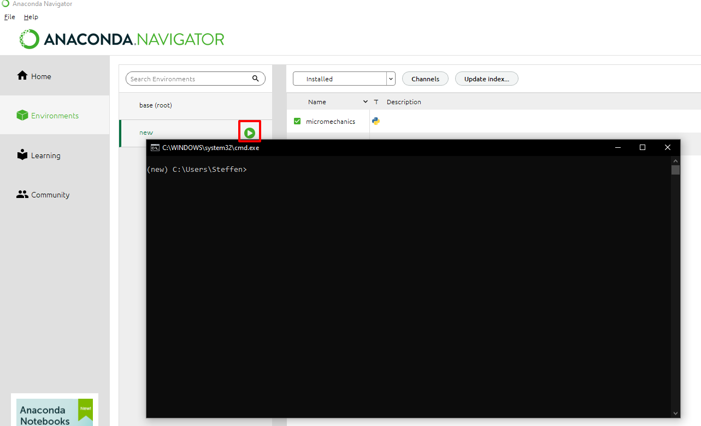
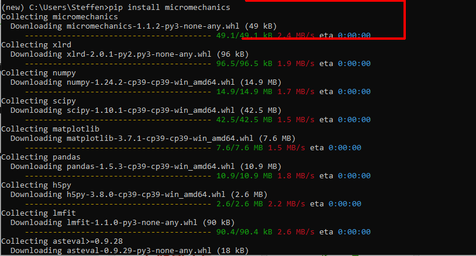

.. _install:

Installation instructions
*************************

Linux and Mac OS
----------------

1. Install by

.. code-block:: bash

    pip install micromechanics

2. Run test using the default data

.. code-block:: bash

    from micromechanics.indentation import Indentation
    i = Indentation()
    i.plotAll()

Windows - Anaconda
------------------

1. Open Anaconda and select 'Environments' on the right side

2. Create a new environment 'new': see buttons at the bottom or use the existing 'base' environment
   and select the green arrow to open a terminal

3. Type in 'pip install micromechanics' and a similar content should be shown

