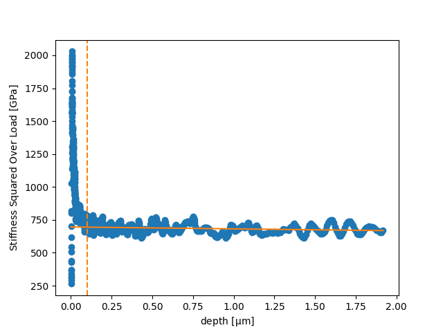
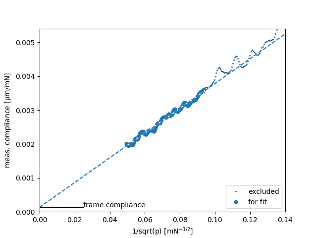
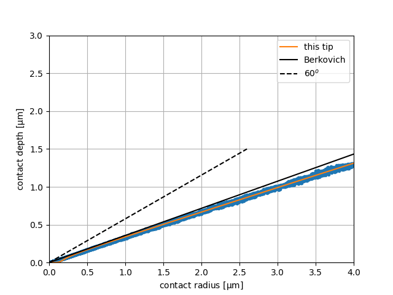
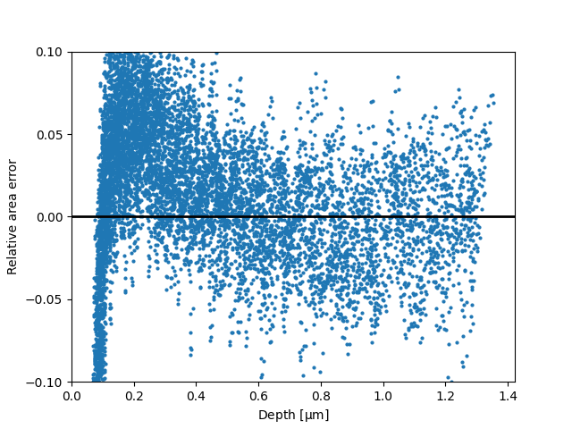
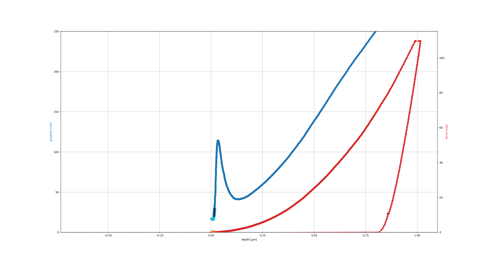

.. _advanced:

Indentation: Advanced usage
***************************

Tip calibration
===============

Initialize the datafile containing the calibration measurements, using nuMat=0.18 as the tip’s Poisson’s ratio::

		from micromechanics.indentation import Indentation, Tip
		i = Indentation("examples/Agilent/FS_Calibration.xls", nuMat=0.18)
		i.analyse()
		i.plotAsDepth("K2P")

``i.plotAsDepth("K2P")`` plots :math:`stiffness^2/load` as a function of the depth and the orange line should be horizontal.

Perform the calibration. Specify "True" for plotStiffness and plotTip  to check the plotted compliance and shape of the tip::

		i.calibration(plotStiffness=True, plotTip=True)

	Stiffness

The datapoints at larger forces (smaller values on the diagram) are used for the fitting.

	Tip Shape

	Error in tip shape calibration

The blue points represent the experimental data. The blunting of the used tip is easily noticeable at the very
beginning of the orange line. A relative error of 5-10% is typical.

(To zoom in the blunted part of the tip, use ``plotIndenterShape()`` at e.g. maxDepth 0.25)::

		i.tip.plotIndenterShape(maxDepth=0.25)

Finally, initialize the measurement data, specifying the tip as the just calibrated one::

		j = Indentation("examples/Agilent/NiAl_250nm_TUIL_max_depth_1000nm_GM3_SM_previousGM1.xls", tip = i.tip)

Continue the analysis with the calibrated tip as described in the "Getting started" section.

Surface detection
=================

Inaccurate surface detection can be critical for achieving reliable indentation results, especially for compliant materials.

When loading the file, specify the ``surface = {}`` parameters for example::

	i = Indentation("examples/FischerScope/N1_1.hdf5", nuMat = 0.5, surface={'load':0.1, 'median filter':5, 'plot':True})

Surface detection can use thresholds such as ``load``, ``stiffness``, ``phase angle``, ``abs(dp/dh)``, or ``dp/dt``.
If the threshold signal is noisy, add a filter such as ``median filter``, ``gauss filter``, or ``butterfilter``.

For converted HDF5 files, per-test surface indices can also be supplied through ``surfaceIdx``.

	Surface detection
